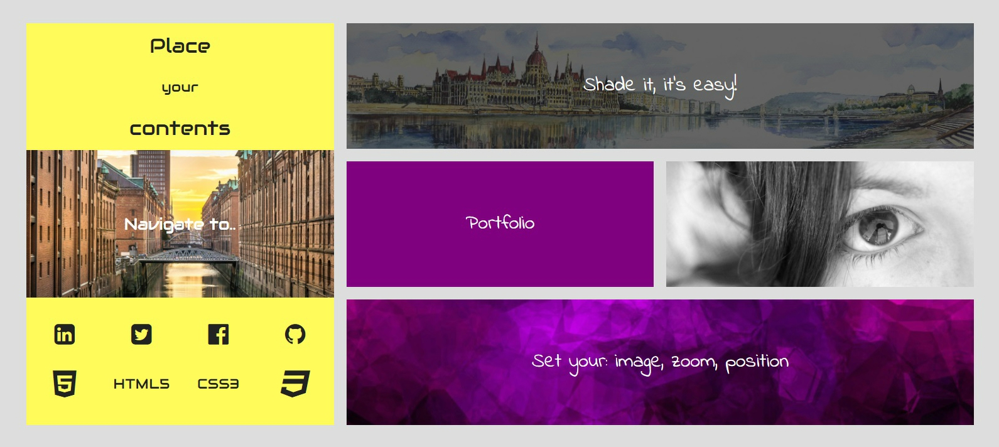

# angular-portfolio

## Description:
  
  A simple angular component that allows you to create a Portfolio, just passing configurations.
  
  
## This project use:
  
   * **Package Manager:** [Bower](https://bower.io/)
    
   * **Framework js:** [Angularjs](https://angularjs.org/)
   
   * **JavaScript utility library:** [Lodash](https://lodash.com/)
    
    
## Installation:
 
   #### **bower install angular-portfolio**
   
## Directive:

 ```html
   <ng-portfolio items="items" areas="areas" generic-config="genericConfig"></ng-portfolio>
 ```
 
## Examples:

  
  
  Configuration for **angular-portfolio** directive or element:
   * **items:** 
   ```js
      [
        {
            //VALUE OPTIONS
              //base usage
            "value": "value to be showed",
              //Use %i% as a placeholder to set in your value, icons
              //i suggest to use font-awesome as icon library
            "value": "this string will contain an icon here --> %i%",
              //to set icon class, it becomes: " string.. <i class="fa fa-html5"></i>"
            "icon": "fa fa-html5",
            
            //FONT
              //To use font-family(css attribute) import a font in your css
              //example: @import url("https://fonts.googleapis.com/css?family=Audiowide");
            "font": "'Audiowide', cursive",
              //font dimension
            "fontSize": "0.8em",
            
            //IMAGE
            "image": "./imgs/hamburg.jpg",
              //SHADE IMAGE
            "shadeFocus": true,
            
            //ZOOM OPTIONS
              //to set zoom operation on item
            "focusScale": 1.6,
              //to set the zoom center, 50% 50% is default (item center)
            "focusCenter": "50% 50%",
            
            //BACKGROUND OPTIONS
              //set text color
            "textColor": "#f96855",
              //set background color
            "backgroundColor": "#FFFA5C",
            
            //HOVER OPTIONS
              //on hover set text color
            "hoverTextColor": "#f96855",
              //on hover set background color
            "hoverBackgroundColor": "#FFFA5C",
            
            //ANIMATIONS
              //set animation time on all properties
              //default for image: "0,5s" else is disabled
            "animationTime": "0.9s",
            
            //ID
              //All items have an id (html id)
              //by default items passed by "items" attribute are sequencially named as "item1", "item2", "item3" etc..
              //But you can override default configuration with:
            "id": "myId",
              //so, for example you can have "item1", "myId", "item3" (if you set id attribute on second items config)
              
             //SUBITEMS
              //In subitems you can set recoursive items configuration
            "subitems": [ 
                  //items..
                  {
                      "value": "%i%",
                      "icon": "fa fa-linkedin-square",
                      "fontSize": "1.2em"
                      //item attributes..
                  },
                  {
                      "id": "mySubId",
                      "subitems":[...]
                  },
                  ...
              ],
             //by default subitems are sequencially named as "(parent id)-sub1", "(parent id)-mySubId", "(parent id)-sub3" etc..
             
            //AREAS
              //look point 2 "areas"
            "areas":[
                  ["item1", "item2", "item3"], 
                  ["item1", "item2", "item3"]
             ]
              
            //GENERICCONFIG
              //look point 3 "generic-config"
            
            //CALLBACKS
              //use this sintax to pass a callback
              //in a configuration (object/json)
            "callback": {
                  "name": "navigate",
                  "params": ["http://www.hamburg.com/"]
            },
            "callback": function(..){....}
              //differences: 
              //To use "callback: function(){..}", you have to set callback with a function in your js, 
              //so you have to manipulate your config.
              //to use "callback: { name: "fn name", params: ["param1", "param2", etc..]}" you don't have to set any 
              //functions to your config, just set in your controller $scope (direct parent of this directive) your function, 
              //es: $scope.navifate = function(url){..};  
        }
      ]
   ```
   * **areas:** 
   ```js
      //areas must contain a matrix of ids, and allows you to design items position and dimensions on your portfolio.
      //By default items are sequencially proposed one per row
      "areas":[
         ["item1", "item2", "."], // "." is a space
         ["item1", "item2", "item3"]
      ]
      //This configuration is well formed and generate this structure:
      
                      |content1|content2|        |
                      |content1|content2|content3|
      
       "areas":[
         ["item1", "item1", "item3"],
         ["item1", "item2", "item3"]
      ]
      //This configuration isn't well formed and generate an error.
      //REMEMBER: this component is maded by divs and you can't have a "L" shaped div or
      //the same div in 2 different and not near positions..
      
                      |content1|content1|content3|
                      |content1|content2|content3|
                      
      //if you have to set subitems areas, you don't have to specify all subitem ids.
      //for example:
      //item
      {
        "subitems":[{...},{"id":"mySubItem",...},{...}]
        "areas":[["sub1", "mySubItem", "sub3"]] instead of [["item1-sub1", "item1-mySubItem", "item1-sub3"]]
      }
      //what a comfort!
   ```
   * **generic-config:** 
   ```js
     //Use generic-config to set generic default behavior of your main portfolio layer or subitems
     //all this options can be overridden by item options.
     
     //STRUCTURE OPTIONS
      //Set portfolio columns, or subitems columns
      //if areas row elements are more than nCols value, nCols is overridden 
     "nCols": 3, 
      //Set portfolio row size, or subitems row size
      //by default is 200px
     "sizeRow": "1fr", 
      //set gap between items
      //by default a media query set general portfolio gap as
      //20px(sreen 1200px+), 10px(sreen 768px+), 0px(sreen 0px+) 
     "gap": "10px",
     
     //BACKGROUND OPTIONS
      //set text color
    "textColor": "#f96855",
      //set background color
    "backgroundColor": "#FFFA5C",

    //HOVER OPTIONS
      //on hover set text color
    "hoverTextColor": "#f96855",
      //on hover set background color
    "hoverBackgroundColor": "#FFFA5C",

    //ANIMATIONS
      //set animation time on all properties
      //default for image: "0,5s" else is disabled
    "animationTime": "0.9s", 
                     
      //FONT
      //To use font-family(css attribute) import a font in your css
      //example: @import url("https://fonts.googleapis.com/css?family=Audiowide");
    "font": "'Audiowide', cursive",
      //font dimension
    "fontSize": "0.8em",                
                               
   ```
   
   <table style="width:100%">
    <tr>
      <th>Overwrite priority</th>
      <th>Portfolio attributes</th>
    </tr>
    <tr>
      <td>1</td>
      <td>item</td> 
    </tr>
   <tr>
      <td>2</td>
      <td>areas</td> 
    </tr>
   <tr>
      <td>3</td>
      <td>generic-config</td>
    </tr>
  </table>
  1 overwrite all
    
  
  
